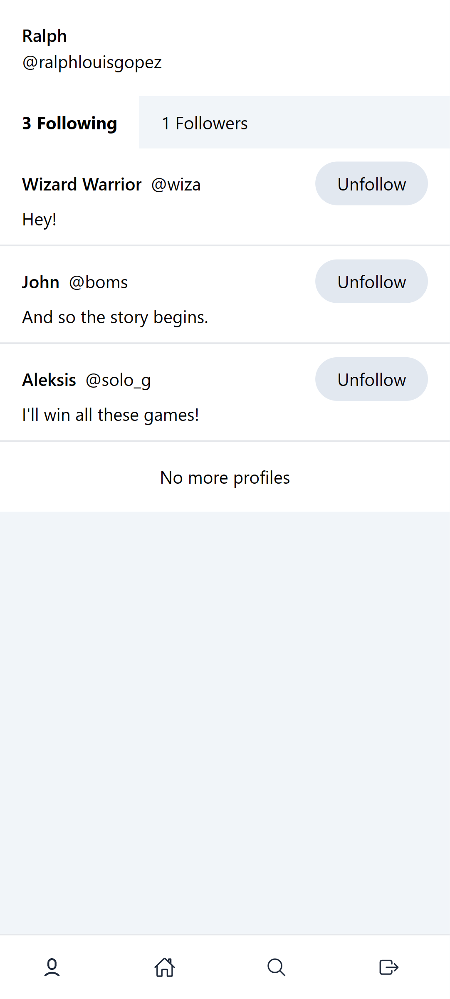
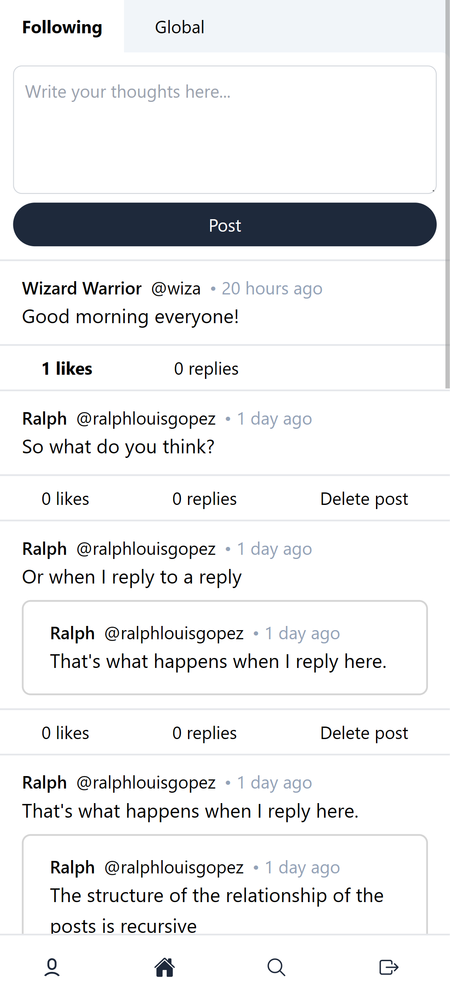

# Ramble Web Client
This is an overview of the ramble web client. There are alternative clients as well. This particular client is mainly powered by React.

## Stack
- [React](https://react.dev) - library to build user-interface.
- [TypeScript](https://www.typescriptlang.org) - better code tooling, analysis without having to run code.
- [TailwindCSS](https://tailwindcss.com) - utility-first CSS framework.
- [Zustand](https://github.com/pmndrs/zustand) - lightweight state management for React.
- [React Router](https://reactrouter.com/en/main) - for managing client-side routes and components.
- [react-icons](https://react-icons.github.io/react-icons/) - icons for React all in one place.
- [react-intersection-observer](https://www.npmjs.com/package/react-intersection-observer) - a React implementation of the Intersection Observer API, mainly used for infinite scroll.

## Environment Variables
### ramble-web-client
This file can be named `.env` or `.env.development.local` or `.env.production.local` and will adjust transpilation or bundling accordingly to whether it is on development or production matching the file names.
```env
# This is URL of the backend (ramble-server).
VITE_BACKEND_URL="http://localhost:8000"
```
**NOTE**: Do not forget to create this file, otherwise issues will persist when using the client.

## Installation
Do `npm install`. As of development, v20.12.2 is the version of Node.js being used. On `ramble-server` do `npm run build` to transpile the files from src into build that `npm start` or `npm run dev` will use.

## Commands
- `npm run dev` - start a development server which will run the client instance when trying the application in a local machine.

## Screenshots
<p>These are all screenshots on the mobile layout.</p>





